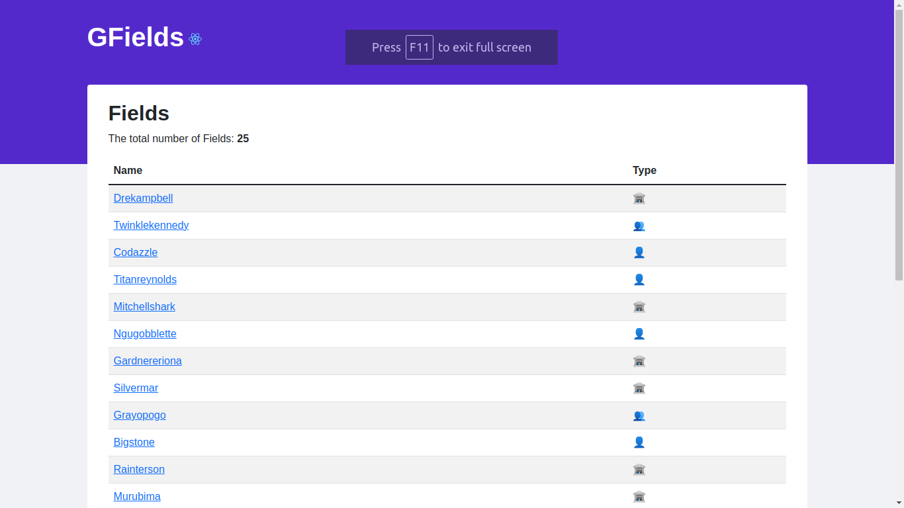

# GFields

Front exercise using https://github.com/afreeorange/mock-api

## Screenshots

## Objectives status

-   [x] A list of all the Fields
-   [x] The total number of Fields
-   [x] The name of each Field
-   [x] A little icon for each Field's type (corporate, collective, individual)
-   [x] A small flag based on a Field's countryCode
-   [x] The Field's area in acres based on its geoData

### Extra objectives

-   [] extra credits
    -   [] Add a toggler that allows the user to switch between acres and hectares (1 m2 = 0.0001 hectares)
    -   [] Add a dropdown to filter by Field type
    -   [] Sort Fields by their area (ascending and descending)
    -   [] Group fields by Country Code

---
